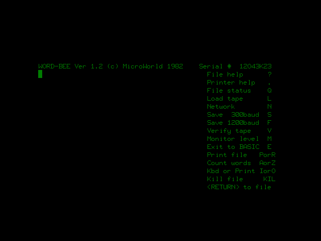
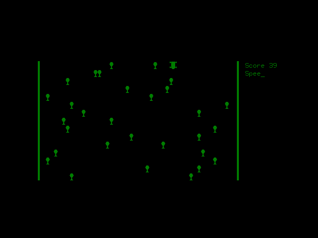
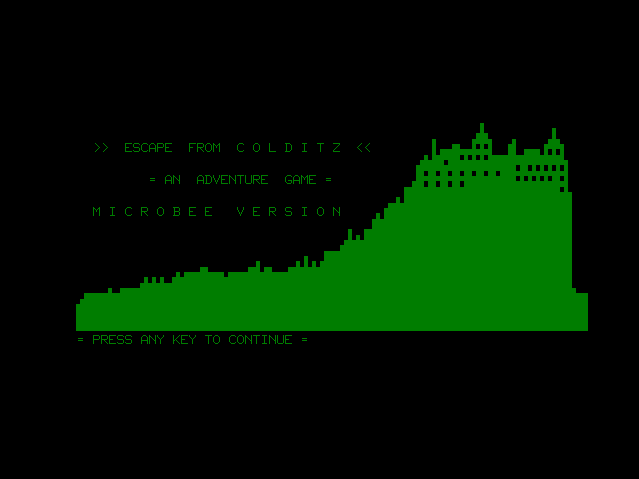
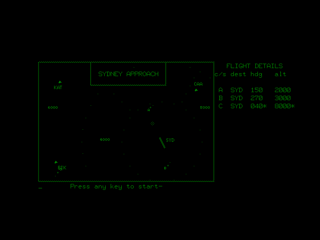

# PicoMozzy Screenshots

The following screenshots are of the emulator in operation. You can generate screenshots at any time while running the emulator by pressing F8. The screenshot will be saved as screen.bmp in the same directory as the emulator.

Cold reset (power on) and warm reset. The first screen is what you saw if you pressed reset-escape (keep holding down escape for a few seconds after you release the reset key), or when you're battery backup failed (sorry, no battery backup in the emulator... yet). The second is what you got normally when the machine was turned on, or reset was pressed (without escape held down). Whatever you had in memory would still be there. There was no operating system per se on the microbee 32k (that didn't come along until the disk based bees) - just a good clean version of basic crammed into a 16k ROM (that's right - a fully functional basic interpretter with graphics, sound and all the trimmings crammed into less memory than you're average wrist-watch).

Of course, the mighty bee came with it's own built-in word processor in ROM. Who needs to spend hours installing word when you can just type edasm and hit return? This one took only 8k. Alternatively, programmers could opt to replace the word processor with an editor/assembler for the z80 - just unplug the old ROM and put in the new one. This option is also available in the emulator, but the edasm screenshot is rather dull.

But everyone knows that the main reason for writing an emulator is the games. I'm still going through my old collection and finding what ran on the 32k machine, but here's some goodies I've dug up so far... First, who could forget frogger? Unfortunately, I seem to have rather lost my touch - more practice needed!

And dodgem - I never did get the car to the bottom of the screen. It seems so easy (and slow) at the start, but don't be fooled!

Escape from colditz and museum. Wow, such amazing graphics ;).

Sydney approach. I've got to admit I'm not to familiar with this one. Nice graphics (well, for the early 80s anyhow), good sound, but I've no idea what keys to use :(. Oh well.

Most games on the 32k were in black and white (well, strictly speaking black and green, at least on the standard monitor), as most bees were sold without the colour board fitted. Brick-out (aka brickles) was originally monochrome, but a colour version did exist. Here's a screenshot of it in all of it's retina burning glory.

## Wayback machine
FILE ARCHIVED ON 13:45:35 Aug 27, 2006 AND RETRIEVED FROM THE INTERNET ARCHIVE ON 10:31:16 Jul 15, 2015.
JAVASCRIPT APPENDED BY WAYBACK MACHINE, COPYRIGHT INTERNET ARCHIVE.

ALL OTHER CONTENT MAY ALSO BE PROTECTED BY COPYRIGHT (17 U.S.C. SECTION 108(a)(3)).